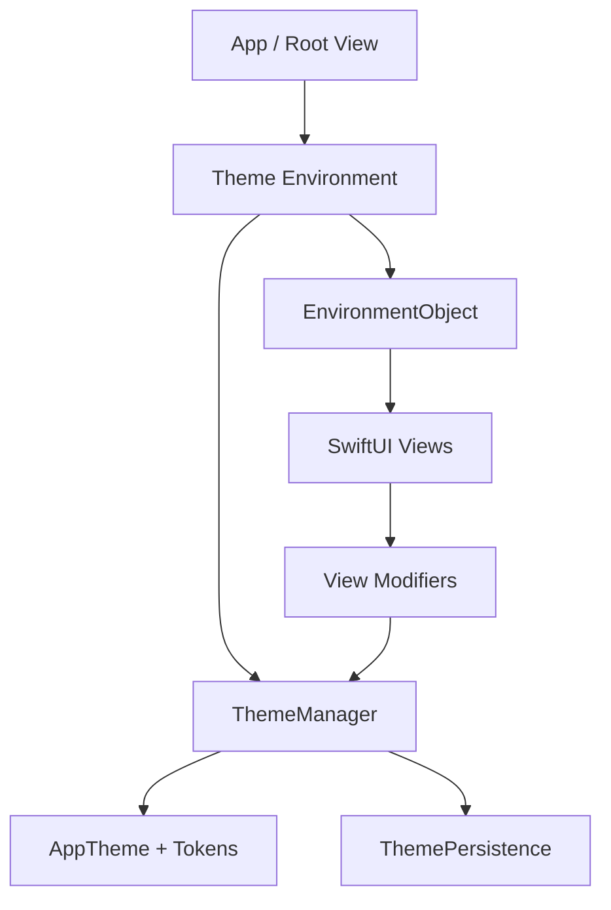

# DynamicThemeKit

A reusable SwiftUI package that provides a complete **dynamic theming engine** for iOS and macOS applications. Switch themes at runtime, override system appearance, persist user preferences, and style views with a small set of ergonomic modifiers.

---

## ✨ Features

* **Light & Dark Mode** — Adapts to system appearance or manual override
* **Custom Themes** — Define themes with colors, typography, spacing, and radius tokens
* **Runtime Switching** — Instantly update UI without restart
* **Central ThemeManager** — `ObservableObject` with reactive state
* **Environment Integration** — Works seamlessly with SwiftUI environment
* **View Extensions** — Clean modifiers for styling
* **Persistence** — Saves preferences using `UserDefaults`
* **Preview Helpers** — Test all themes easily
* **Bonus** — Animations, palette generation, WCAG contrast support

---

## 📦 Requirements

* iOS 17+ / macOS 14+
* Swift 5.9+
* Xcode 15+

---

## 📥 Installation

### Swift Package Manager

```swift
dependencies: [
    .package(url: "https://github.com/your-org/DynamicThemeKit.git", from: "1.0.0")
]
```

Or via Xcode:
**File → Add Package Dependencies**

---

## 🚀 Quick Start

### 1. Inject ThemeManager

```swift
import SwiftUI
import DynamicThemeKit

@main
struct MyApp: App {
    @StateObject private var themeManager = ThemeManager()

    var body: some Scene {
        WindowGroup {
            ContentView()
                .themeEnvironment(themeManager)
        }
    }
}
```

---

### 2. Use Themed Views

```swift
struct ContentView: View {
    var body: some View {
        VStack(spacing: 16) {
            Text("Hello, World!")
                .themedFont(.largeTitle)
                .themedTextColor()

            Text("Accent label")
                .themedAccent()

            Button("Get Started") { }
                .buttonStyle(ThemedButtonStyle(variant: .primary))
        }
        .themedPadding(.all, .lg)
        .themedBackground()
    }
}
```

---

### 3. Switch Themes

```swift
struct SettingsView: View {
    @EnvironmentObject var themeManager: ThemeManager

    var body: some View {
        Picker("Theme", selection: themeSelection) {
            ForEach(themeManager.availableThemes) { theme in
                Text(theme.name).tag(theme.id)
            }
        }

        Button("Toggle Dark Mode") {
            themeManager.toggleDarkMode()
        }
    }

    private var themeSelection: Binding<String> {
        Binding(
            get: { themeManager.currentTheme.id },
            set: { themeManager.setTheme(id: $0) }
        )
    }
}
```

---

## 🧱 Package Structure

```
Sources/DynamicThemeKit/
├── Models/
├── Manager/
├── Environment/
├── Extensions/
├── Utilities/
├── Previews/
└── Demo/
```

---

## 🎯 Core API

### ThemeManager

* `currentTheme`
* `appearanceMode`
* `availableThemes`
* `setTheme(_:)`
* `setTheme(id:)`
* `toggleDarkMode()`
* `setAppearanceMode(_:)`
* `registerTheme(_:)`

---

### View Modifiers

* `.themedBackground()`
* `.themedTextColor()`
* `.themedAccent()`
* `.themedFont(_:)`
* `.themedCornerRadius(_:)`
* `.themedPadding(_:_:)`
* `.themeEnvironment(_:)`

---

## 🎨 Built-in Themes

* **Default** — Clean neutral palette
* **Ocean** — Cool blue tones
* **Sunset** — Warm orange palette

---

## 🧩 Custom Theme Example

```swift
let myTheme = AppTheme(
    id: "brand",
    name: "Brand",
    colors: ThemeColors(...),
    typography: .standard,
    spacing: ThemeSpacing(md: 20),
    cornerRadius: ThemeCornerRadius(medium: 14)
)

themeManager.registerTheme(myTheme)
themeManager.setTheme(myTheme)
```

---

## 🎨 Dynamic Palette

```swift
let generated = DynamicPaletteGenerator.theme(
    id: "user",
    name: "Custom",
    seedColor: .purple
)
```

---

## ♿ Accessibility

WCAG-compliant contrast handling:

```swift
ThemeContrast.accessibleTextColor(...)
```

---

## 🧪 Previews

```swift
#Preview {
    ThemePreview.AllThemesGallery()
}
```

---

## 🧠 Architecture



---

## 💾 Persistence

Stored keys:

* `selectedThemeID`
* `appearanceMode`

Disable:

```swift
ThemeManager(restorePersistedState: false)
```

---

## 🧪 Testing

```bash
swift test
```

---

## 📄 License

MIT License
